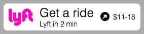

# Lyft Web Button [DEPRECATED]

## DEPRECATED

Please note that this project is now deprecated, and will no longer be directly supported.

[Documentation](https://github.com/lyft/lyft-web-button/blob/master/doc/README.md)
 | [Code of Conduct](https://github.com/lyft/lyft-web-button/blob/master/CODE_OF_CONDUCT.md)
 | [Contributing](https://github.com/lyft/lyft-web-button/blob/master/CONTRIBUTING.md)
 | [License](https://github.com/lyft/lyft-web-button/blob/master/LICENSE)
 | [Support](#support)
 | [Lyft.com/developers](https://www.lyft.com/developers)

## Quick Start / Usage

1. Sign up for a `client_id` and `client_token` at [lyft.com/developers](https://www.lyft.com/developers).
2. Grab the component itself from [dist](https://github.com/lyft/lyft-web-button/blob/master/dist).
3. Copy an example html file from [dist](https://github.com/lyft/lyft-web-button/blob/master/dist) and fill in the blanks.

See the example file for a sample configuration object:

```js
var OPTIONS = {
  scriptSrc: 'lyftWebButton.js', // path to script location on your server
  namespace: '', // optional namespace
  clientId: '',
  clientToken: '',
  location: {
    pickup: { // optional; leave as an empty object to use current location if document.navigator is available
      latitude: '37.7604',
      longitude: '-122.4132',
    },
    destination: {
      latitude: '37.7604',
      longitude: '-122.4132',
    },
  },
  parentElement: document.getElementById('lyft-web-button-parent'), // where to place the button on your page
  queryParams: {
    credits: '' // optional credits param is the only accepted redirect parameter presently
  },
  theme: 'multicolor large', // see below for theme options
};
```

### Theme options

Several themes are available; see `dist/development.multiple.html` for all possible examples, or look in `src/components/lyftWebButton/index.css` for the CSS.

If you chose `lyftWebButton` and configured it correctly it should look like this:



If you want to build your own components or modify existing ones you'll need to continue reading.

## Modifying and Building Components

### Installation

To build this from source make sure you have the following:
- [git](https://git-scm.com/downloads) (latest version)
- [node](https://nodejs.org) (>=4.0.0)
- npm (auto-installs with node)

Next, open a shell session and enter the following commands:
```bash
# clone repository
git clone https://github.com/lyft/lyft-web-button.git

# install dependencies
cd lyft-web-button
npm install
```

### Development

1. Start the server with `npm start` (or `npm run-script start`).
2. Open [webpack-dev-server](http://localhost:8080) in a web browser.
3. As you work the page will automatically update via websocket connection.

_Alternatively, you can run `npm watch:dev` to build assets without using `webpack-dev-server`._

### Scripts
```bash
# build
npm run-script build

# build with minification
npm run-script build:dist

# regenerate documentation
npm run-script doc

# lint
npm run-script lint

# test (silence ELIFECYCLE output)
npm run-script --silent test
```

### Limitations
- `lyftWebButton` can appear more than once on a page, but the implementation needs improvement.
- `lyftWebModal` uses a single theme, but it can be overridden with CSS.
- `lyftWebModal` only supports Google Maps at this time, but it may be worth allowing a custom background image.

## Support

If you're looking for help configuring or using the Lyft Web Button, or if you have general
 questions related to our APIs, the Lyft Developer Platform team provides support through
 our [forum](https://developer.lyft.com/discuss) as well as on Stack Overflow using the
 `lyft-api` tag. _Please do not create tickets on help.lyft.com as this is our help desk
 for regular users, and we won't be able to respond to requests made there._

## Reporting Security Vulnerabilities

If you've found a vulnerability or a potential vulnerability in the Lyft Web Button please
 let us know at security@lyft.com. We'll send a confirmation email to acknowledge your
 report, and we'll send an additional email when we've identified the issue positively or
 negatively.
