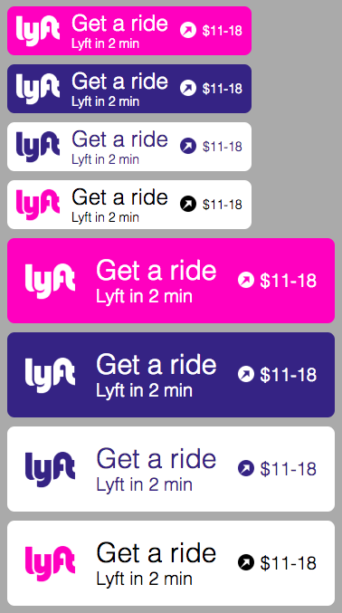

# Documentation

<!-- div class="toc-container" -->

<!-- div -->

## Post-webpack Distributables
* <a href="dist/lyftWebButton.md">`Lyft Web Button`</a>

## Pre-webpack Sources
* <a href="src/components/lyftWebButton/index.md">`components/lyftWebButton`</a>
* <a href="src/components/lyftWebModal/index.md">`components/lyftWebModal`</a>
* <a href="src/services/api.md">`services/api`</a>
* <a href="src/services/jsonp.md">`services/jsonp`</a>
* <a href="src/services/selector.md">`services/selector`</a>

<!-- /div -->

<!-- /div -->

# Screenshots of Distributables

_Note: This file is edited by hand and may be out of date. Please regenerate the documentation and browse manually if anything appears to be broken._
